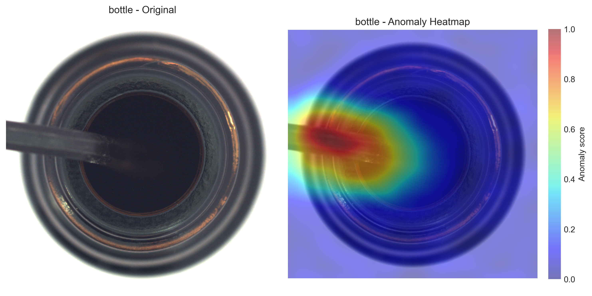

# 🔍 Industrial Anomaly Detection — SimpleNet (CVPR 2023) Replication

> Replication of **SimpleNet: A Simple Network for Image Anomaly Detection and Localization** (CVPR 2023) for unsupervised industrial defect detection on the MVTec AD dataset.

---

## 📌 Project Overview

This project replicates the SimpleNet architecture from CVPR 2023 for **unsupervised anomaly detection** in industrial quality inspection settings. The model is trained only on normal (defect-free) images and learns to detect and localise anomalies at both the image level and pixel level — without any labelled defect data.

Applied to the **bottle class** of the MVTec Anomaly Detection dataset.

---

## 🏆 Results

| Metric | Score |
|--------|-------|
| Image-wise AUROC | **1.000** ✅ |
| Pixel-wise AUROC | **0.979** |
| PRO AUC | 0.893 |

> Image AUROC of 1.000 means the model perfectly separates normal from anomalous images with zero false positives at the optimal threshold.

---

## 📊 Visualisations

### Anomaly Heatmap
The model generates pixel-level anomaly scores overlaid on the original image. Red regions indicate high anomaly scores — in this case correctly highlighting a foreign object inside the bottle.



---

### Image-wise ROC Curve


---

### Pixel-wise ROC Curve


---

### Mean Anomaly Heatmap (across all anomalous samples)


---

### Anomaly Score Distribution
Normal samples cluster near zero while anomalous samples score significantly higher — showing clear separability.


---

## 🧠 How It Works

SimpleNet works by:

1. **Feature Extraction** — A pretrained ResNet backbone extracts multi-scale features from input images
2. **Feature Adaptation** — A small trainable network adapts pretrained features to the target domain
3. **Anomaly Scoring** — A discriminator network learns to distinguish normal adapted features from artificially generated anomalous ones
4. **Localisation** — Pixel-level anomaly maps are generated by scoring patch-level features across the image

The key insight of SimpleNet is that by adding small Gaussian noise to normal features, you can synthesise pseudo-anomalies at training time — eliminating the need for any labelled defect examples.

---

## 📁 Repository Structure

```
simplenet-anomaly-detection/
│
├── simplenet.py          # Core SimpleNet model architecture
├── backbones.py          # ResNet feature extractor
├── resnet.py             # ResNet implementation
├── common.py             # Shared utilities and data loading
├── main.py               # Training and evaluation entry point
├── metrics.py            # AUROC, PRO, and evaluation metrics
├── generate_evaluations.py  # Evaluation and visualisation generation
├── utils.py              # Helper functions
│
├── run.sh                # Training script (Linux)
├── run_training.bat      # Training script (Windows)
├── run_training_full.bat # Full training script (Windows)
├── run_evaluations.bat   # Evaluation script (Windows)
│
├── requirements.txt      # Dependencies
│
└── results/              # Output visualisations and metrics
    
```

---

## ⚙️ Setup & Usage

### 1. Install Dependencies

```bash
pip install -r requirements.txt
```

### 2. Download MVTec AD Dataset

Download the [MVTec Anomaly Detection dataset](https://www.mvtec.com/company/research/datasets/mvtec-ad) and place it in the `datasets/` folder:

```
datasets/
└── mvtec/
    └── bottle/
        ├── train/
        └── test/
```

### 3. Train the Model

**Windows:**
```bash
run_training_full.bat
```

**Linux:**
```bash
bash run.sh
```

### 4. Run Evaluation & Generate Visualisations

```bash
run_evaluations.bat
```

---

## 📦 Dependencies

See `requirements.txt` for full list. Key libraries:

- Python 3.8+
- PyTorch
- torchvision
- scikit-learn
- OpenCV
- NumPy
- Matplotlib

---

## 📄 Original Paper

> **SimpleNet: A Simple Network for Image Anomaly Detection and Localization**
> Zhikang Liu, Yiming Zhou, Yuansheng Xu, Zilei Wang
> CVPR 2023
> [Paper Link](https://openaccess.thecvf.com/content/CVPR2023/papers/Liu_SimpleNet_A_Simple_Network_for_Image_Anomaly_Detection_and_Localization_CVPR_2023_paper.pdf)

---

## 👤 Author

**Omer Farooq**
BS Artificial Intelligence — Information Technology University (ITU), Lahore
[GitHub](https://github.com/omer-687)

---

## 📝 Note

This project is an academic replication of the SimpleNet paper completed as part of coursework at ITU Lahore. The goal was to understand, implement, and validate the paper's methodology on the MVTec AD benchmark.
